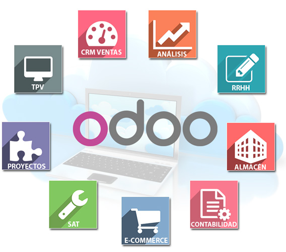
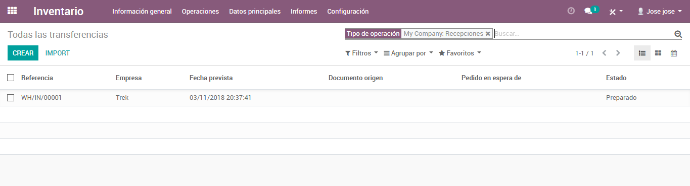
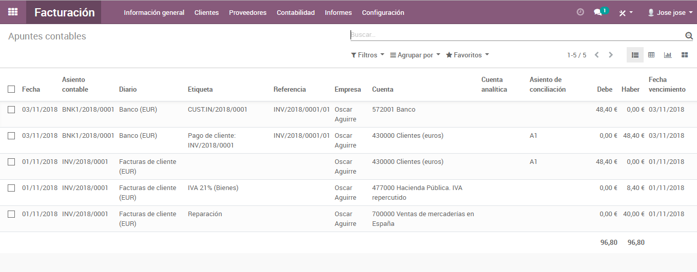

# Proyecto RP

* [Introducción](#Introducción)
* [Contexto](#Contexto)
* [Objetivo](#Objetivo)   
* [Contenido y anexos del proyecto](#Contenido-y-anexos-del-proyecto)
* [Partida](#Situación-de-partida)
    * [Presentación de la empresa](#Presentación-de-la-empresa)
    * [Estructura organizativa](#Estructura-organizativa)
    * [Motivación de cambio](#Motivación-de-cambio)
    * [Tecnología actual](#Tecnología-actual)
         * [Estado tecnológico hardware](#Estado-tecnológico-hardware)
         * [Estado tecnológico software](#Estado-tecnológico-software)       
* [Fase de adopción del sistema](#Fase-de-adopción-del-sistema)
    * [Motivos del cambio](#Motivos-del-cambio)
         * [Razones tecnológicas](#Razones-tecnológicas)
         * [Razones del proceso de negocio](#Razones-del-proceso-de-negocio)
         * [Razones estratégicas y de competitividad](#Razones-estratégicas-y-de-competitividad)
              * [Nuevos nichos de mercado](#Nuevos-nichos-de-mercado)
              * [Mejora en la calidad del servicio](Mejora-en-la-calidad-del-servicio)   
    * [Enfoque de los cambios a realizar](#Enfoque-de-los-cambios-a-realizar) 
    * [Identificación de los beneficios](#Identificación-de-los-beneficios)
    * [Identificación de los riesgos](#Identificación-de-los-riesgos)
    * [Previsión de costes](#Previsión-de-costes)
    * [Alcance del proyecto](#Alcance-del-proyecto)       
* [Selección del tipo de ERP](#Selección-del-tipo-de-ERP)
    * [Metodología del trabajo. Análisis de la situación](#Metodología-del-trabajo.Análisis-de-la-situación)
        * [Identificación de los departamentos](#Identificación-de-los-departamentos)
            * [Departamento de administración](#Departamento-de-administración)
            * [Departamento comercial](#Departamento-comercial)
            * [Departamento taller/reparación](#Departamento-taller/reparación)
        * [Metodología del trabajo. Prospección de mercado](#Metodología-del-trabajo.Prospección-de-mercado)
        * [Metodología del trabajo. Proveedor](#Metodología-del-trabajo.-Proveedor)
* [Implantación de la ERP](#Implantación-de-la-ERP)
    * [Odoo](#Odoo)
        * [Odoo Estructura modular](#Odoo-Estructura-modular)
        * [Odoo.Desengranaje modular](#Odoo.-Desengranaje-modular)
* [Conclusión](#Conclusión)
* [Bibliografía](#Bibliografía)
* [Anexo](#Anexo)

## Introducción

## Contexto

    Este trabajo consiste en describir los procesos necesarios para
    implantar una ERP en una empresa estableciendo como parámetros las
    necesidades reales del negocio de la empresa. Estos procesos irán desde
    el análisis de la estructura empresarial de la empresa, selección de lo
    que se quiere mejorar, descripción detallada de la estructura de la ERP,
    procesos a realizar a la hora de su implantación, objetivos a cubrir y
    descripción de su puesta en funcionamiento.
    
     
## Objetivo 

        El objetivo del proyecto será la descripción detallada de la empresa,
        descripción de cada departamento del negocio y de los módulos de la ERP
        que se van a utilizar justificando la elección, proceso que se lleva a
        cabo con cada uno de ellos para su implantación, descripción de
        proveedores, clientes, productos etc. y detallar cualquier aspecto que
        se considere importante en el proceso de implantación de la ERP, así
        como adjuntar todo tipo de documentación que ayude a la comprensión del
        proyecto.
        
## Contenido y anexos del proyecto

    El conjunto de este trabajo estará compuesto por:

    -   Memoria: Este documento, donde se detalla y describe todo el trabajo.
    -   Imágenes: Imágenes anexas que servirán de material de apoyo para la
        comprensión de todo lo descrito en la memoria.
    -   Video tutorial: Como anexo a esta memoria se incluirá un vídeo tutorial de
        la instalación de Odoo y una breve explicación de su funcionamiento en la
        empresa y cuya finalidad será la de explicar de forma sencilla cómo funciona
        una ERP en una empresa real y procesos de negocio que podrían darse para
        comprender la interacción modular de la aplicación.
    -   Presentación: Puesta en público de la ERP diseñada y mediante la cual se
        explicará el desrrollo de esta memoria.  
          
## Situación de partida

## Presentación de la empresa

        La empresa que he seleccionado se trata de una taller de bicicletas,
        venta-reparación-respuestos de bicicletas concretamente.
        Bicicletas EGIBIDE, que es así como se llama comercialmente, se trata de
        una pequeña empresa situada en la Calle Arriaga s/n de Vitoria-Gasteiz,
        cuya actividad comercial es la venta y reparación de bicicletas, así
        como el montaje de las mismas y la venta de todo tipo de repuestos y
        componentes de la bicicleta, así como todo tipo de material relacionado
        con el mundo del ciclismo.
        Bicicletas Egibide es una empresa con mucha tradición en la ciudad de
        Vitoria cuya actividad principal es la reparación y venta de bicicletas
        donde su principal proveedor es Trek, con respecto a componentes trabaja
        principalmente con la marca Shimano y en tema de ropa deportiva con
        Spiuk.
        
### Estructura organizativa

        En lo que respecta a su estructura organizativa hay que destacar que se
        trata de una empresa de carácter familiar por lo que no tiene
        especificados claramente los departamentos de la empresa donde todos
        hacen un poco de todo.
        
        El socio fundador de la propia empresa trabaja en la propia tienda
        realizando todo tipo de tareas sin tener una propia que pudiera decir
        que pertenence a un departamento en concreto. Por otro lado Bicicletas
        Egibide tiene en nómina a tres empleados dos de los cuales trabajan en
        el taller mecánico realizando las funciones de reparación mantenimiento
        así como en numerosas ocasiones las de atención al público
        y otro empleado más realizando las tareas propias de la tienda como
        pueden ser la de venta de material, repuestos y servicio post venta.
        
        Por lo tanto se podrían distinguir los siguientes departamentos:
            
        -   Administración- Dirección - RRHH: Llevada por el propio propietario de la
            empresa.
        -   Venta: Un empleado que atiende la venta al público, así como el servicio
            post venta. También este departamento está tendido por le dueño del negocio.
        -   Reparación: Este departamento está ocupado por dos mecánicos y en ocasiones
            ayudados por becarios o personal en prácticas.
            Su organigrama podría ser el siguiente:
            

    
### Motivación de cambio

    Debido al auge del deporte del ciclismo que está teniendo la ciudad de
    Vitoria-Gasteiz , así como deportes relacionados como son la práctica de
    Triatlón y el auge que está teniendo la ciudad en materia de movilidad
    sostenible, bicicletas Egibide está viendo en los últimos años cómo su
    negocio crece y requiere a su vez de una actualización empresarial para
    adecuarse a los tiempos actuales, así como a la demanda de los servicios
    reclamados por sus clientes.
    El avance de las nuevas tecnologías hacen perder a esta pequeña empresa de
    oportunidades de negocio, y los cambios culturales de la sociedad en materia
    de hábitos de consumo, como es claramente la cada vez mayor utilización de
    internet para comprar cualquier tipo de producto, hace que bicicletas
    Egibide se plantee una reestruccturación de su negocio queriendo incorporar
    a su gestión empresarial el uso de las nuevas tecnologías, así como llevar a
    cabo un cambio en su organigrama enpresarial para atender la demanda de una
    manera más eficaz y profesional acorde con los tiempos actuales.

## Tecnología actual.

### Estado tecnológico hardware.

     Actualmente Bicicletas Egibide dispone de un único PC que está instalado
     en la tienda en el mostrador de atención al público. Es un ordenador
     actual, que no tiene ningún problema de uso por lo que facilita mucho el
     trabajo de implantación de la ERP.  
        
### Estado tecnológico del software.

      Referente al software del equipo hay que destacar que no dispone de
      herramienta alguna referente a temas relacionados con el marketing y
      ventas, aspecto que le resta competitividad a la empresa, tampoco
      dispone de una aplicación que le ayude en el control o seguimiento del
      tema contable y financiero , de la misma manera no dispone de software
      alguno relacionado con el taller y por último decir que únicamente
      dispone de las usuales herramientas ofimáticas, en este caso Windows
      Office.
      
## Fase de adopción del sistema
### Motivos al cambio.
### Razones tecnológicas.

    Como bien se ha detallado en el apartado anterior, bicicletas
    Egibide no dispone de una infraestructura tecnológica adecuada a 
    lostiempos actuales.
    
    Debido al comercio electrónico, al marketing y publicidad on-line,
    las RRSS, el incremento del uso de internet para cualquier aspecto
    cotidiano por parte de la sociedad y sobre todo en lo que se refiere
    Egibide no dispone de una infraestructura tecnológica adecuada a los 
    tiempos actuales.
    
    Debido al comercio electrónico, al marketing y publicidad on-line,
    las RRSS, el incremento del uso de internet para cualquier aspecto
    cotidiano por parte de la sociedad y sobre todo en lo que se refiere
    a un comercio.
    
    Por otro lado como estructura interna de empresa no dispone de un
    software básico para desempeñar más eficiente las funciones internas
    de la empresa, bien sea en departamentos de RRHH, de Marketing, de
    Producción o de Contabilidad.   
                        
### Razones del proceso de negocio.

    Todo este retraso en tecnología hace que bicicletas Egibide reitere en malos
    hábitos de trabajo tanto internamente como externamente de cara al cliente.
    En numerosas ocasiones no hay una relación adecuada de comunicación entre
    las secciones de la empresa, bien porque muchas veces un departamento hace
    las funciones de otro a la vez que el suyo, o bien porque uno depende del
    otro sin necesidad alguna.
    
    El cliente muchas veces reclama otro tipo de atención, bien sea de mayor
    calidad, con mayor rapidez o por otras vías que no sean la tradicional del
    cara a cara en la tienda física.
    
    Por lo tanto todo esto hace que no se trabaje en el proceso de negocio de
    manera eficaz, profesional y de forma competitiva.

### Razones estratégicas y de competitividad.

### Nuevos nichos de mercado.

    Como bien se ha destacado al no tener una actualización empresarial se
    desaprovechan nuevas formas de hacer negocio o de las nuevas vías de
    comercio actuales como es internet. Sobre todo en una empresa como este tipo
    es indispensable presencia on-line.
    
### Reestructuración departamental.

    Al no tener una organización departamental clara las funciones se doblan, no
    hay claridad en los trabajos de cada empleado u empleada, el servicio se
    hace por duplicado en numerosas ocasiones y no hay una relación fluida y
    concordante entre los departamentos de la empresa.
    
### Mejora en la calidad del servicio.

    Al ser una empresa de carácter comercial y servicios lo primordial es la
    calidad del servicio realizado. Toda esta desorganización y desactualización
    de la que hemos hablado hace mella o se refleja en servicios de poca
    calidad. Por lo tanto una organización mejor estructurada y organizada hace
    que su servicio mejore.

### Enfoque de los cambios a realizar.

    Teniendo en cuenta todo lo analizado en los apartados anteriores el enfoque
    sería el siguiente:
    -   Departamaneto de administración:
            Sería el vértice de la pirámide de la organización de la empresa. Desde
            aquí el gerente podría acometer funciones propias de administración de
            la tienda como pueden ser:
        -   RRHH.
        -   Contabilidad y fiscalidad.
        
    -   Departamento comercial:
            Aquí se encajarían las funciones que se realizan en tienda donde se
            podría mejorarlo con presencia de becarios o personal en prácticas para
            ampliar las funciones del departamento dejándolo de la siguiente manera:
        -   Marketing y publicidad.
        -   Compras.
        -   Ventas y atención al público.
        -   Recambios.
        -   Logística.
        
    -   Departamento de servicio post-venta y de calidad:
           Se crearía un nuevo departamento claramente identificado que podría ser
           de tipo puente entre el departamento comercial y el de
           producción-taller. Las funciones del mismo quedarían identificadas de la
           siguiente manera:
            -   Atención al público.
            -   Servicio post-venta.
            -   Calidad.
    -   Departamento de producción o de taller:
            Este estaría ligado al comercial y post-venta los cuales harían de
            filtro para ordenar cualquier orden de trabajo. Quedaría de la siguiente
            forma:
            -   Reparación.
            -   Montaje.
            -   Revisiones y mantenimiento.
        
### Indentificación de los beneficios.

    Con la implantación de la ERP se espera por tanto conseguir los
    siguientes beneficios:
        
    -   Reestructuración de forma clara de los departamentos de la empresa. Se
        aprovecha este paso para reorganizar a los trabajadores, definir las
        funciones de cada uno o una y la identificación de cada departamento tanto
        virtual, física y funcional.
        
    -   Presencia en nuevos mercados con la presencia on-line. Al ser un negocio de
        tipo servicios es crucial hoy en día tener una presencia en internet. En
        este caso se podrá adentrar en la venta on-line, dar una mayor rapidez en
        todo tipo de servicios y por lo tanto tener un mejor servicio en todos los
        aspectos.
        
    -   Se mejorará en toda relación departamental ya que toda operación quedará
        reflejada y documentada, los departamentos estarán mejor comunidados, mayor
        rapidez en el flujo de la comunicación y una mayor estructuración y
        organización en todos los trabajos.
        
    -   Automatización de todas las órdenes de trabajo. Se podrá tener un mayor
        control de todos estos trabajos y en los cuales habrá mayor accesibilidad y
        transparencia por todos y en todos los departamentos de la empresa.
        
    -   Se prevé un incremento de las ventas al tener presencia en mercados nuevos,
        por lo que se podrá llegar a nuevos clientes, presencia comercial virtual en
        otras zonas geográficas y por lo tanto mejor comunicación con clientes y
        acceso a nuevos clientes potenciales.
        
    -   También se mejorará en el control finaciero y administrativo de la empresa.
        Con la ERP se tendrá acceso de forma rápida a aspectos relacionados con los
        RRHH de la empresa, mayor control sobre ellos, a la contabilidad de la
        empresa y así ser más competitivos y en general a todo el organigrama
        administrativo de bicicletas Egibide.
    
### Identificación de los riesgos:

    Se realiza un estudio de los riesgos que pueden surgir en esta fase de
    implantación de la ERP así como el estudio de la manera de afrontarlos y
    minimizarlos.
    -   Puede ser una implantación costosa teniendo en cuenta que requiere de la
        formación de los trabajadores de la empresa. A parte del esfuerzo que
        requiere por parte de estos hay que tener en cuenta que la formación de
        estos supone un esfuerzo económico añadido por parte de la empresa en su
        implantación.
    -   Adaptación a las nuevas formas de trabajo dado que todo va a ser más
        estructurado y organizado. Con la implantación de la ERP supondrá que van a
        tener que llevar a cabo un nuevo trabajo de administración.
    -   Podría haber pérdida de datos históricos, es decir datos de ventas de años
        anteriores, facturaciones, gastos, datos económicos al no poseer
        internamente un departamento como tal y tener el servicio de una asesoría
        contable externa.
    -   Problemas en el sentido de que supondrá un gran problema añadido para dar
        una continuidad a la empresa ligándolo a la ERP. Es decir, habrá que
        insertar todo tipo de datos en el sistema de la ERP, datos de stocks, datos
        económicos, datos de proveedores por ejemplo etc. por lo que al ser una
        labor muy costosa podría conllevar a perdida de datos importantes y que
        hagan que el funcionamiento interno de la ERP no trabaje con unos datos 100%
        exactos.
    -   Mala parametrización y no adecuación de las necesidades de la empresa al
        sistema ERP. Esto puede repercutir en el aspecto económico, a una mala
        satisfación en el servicio requerido de la ERP, mal funcionamiento de la
        misma o desaprovechamiento técnico de la misma si no se instala lo
        necesario.
    -   La labor de entendimiento con la empresa desarrolladora de la ERP podría ser
        tediosa, no eficiente, por lo que en este aspecto hay que prestar gran
        atención al tener claro que se quiere o qué se necesita.

### Previsión de costes.

    Antes de comenzar un proyecto de esta envergadura hay que tener en
    cuenta que va a suponer un gasto contable para la empresa, que podría se
    de tipo inversión y que habría que amortizarlo. A parte de esto hay que
    estimar los beneficios que van a tener la implantación de la ERP en la
    empresa para que compense el coste de la misma por lo que hay que
    analizar el retorno de la inversión.
    Para todo ello, antes hay que conocer a groso modo los costes que podría
    suponer la contratación de la ERP:
    -   Coste de adquisición del programa: se estima que podría costar en torno a
        20.000 – 30.000 euros. Aquí hay que tener en cuenta qué tipo de ERP se
        adquiere, si standar o a medida, esta última sería más cara.
    -   Costes de licencias de usuario: se calcula que podría ser en torno a 100 –
        750 euros por usuario.
    -   Costes de mantenimiento y actualizaciones anuales: hay que tener en cuenta
        también que una ERP o todo sistema informático requiere de un mantenimiento
        y de unos servicios de consultoría. Esto podría costar entre 1000 – 3000
        euros anuales.
    -   Coste de hardware ( servidores, pc): habría que estimar si se requiere de
        algún ordenador nuevo, servidor u otras herramientas informáticas. En este
        caso rondaría los 700 euros centrándonos en la adquisición de algún pc
        nuevo.
    -   Costes de implantación: este proceso también tendría un coste. Aunque
        también habría que tener en cuenta qué tipo de ERP se implanta, si standar o
        a medida.
    -   Costes de formación a los usuarios: aquí habría que calcular nº de horas
        necesarias en formación y coste de tener un profesor enseñando o un
        formador.
    -   Costes de reingienería de los procesos: habría que calcular el estado del
        sistema actual, pruebas piloto etc. Es decir el nº de horas necesarias para
        verificar todo.
        En resumen, teniendo en cuenta toda la previsión de gastos anteriormente
        señalada se podría realizar la siguiente estimación económica:
        . 2.500 euros implantación del sistema
        . 1200 euros en horas de pruebas, formación etc.
        . 1000 euros en hardware.
        . 1500 euros mantenimientos.
        . **Total: 6.200 euros**/1er año. ( el resto de años 1500 de mantenimiento).
    -   (Nota) Para calcular el retorno de la inversión habría que determinar el
        beneficio económico de la ERP y los años de amortización. Estos datos
        requerirían de un mayor estudio económico, pero el contexto del proyecto
        entiendo que no conlleva a ello por lo que se doy por hecho que se presenta
        el proyecto en gerencia y se da luz verde al desarrollo del mismo.
        
### Alcance del proyecto.

    El ERP es un sistema global que en mayor o en menor medida va a
    repercutir en todos los departamentos de la empresa. Todos ellos van a
    tener que hacer uso del sistema y adecuarse a las nuevas formas de
    trabajar que no va a ser nada más ser más organizado y registrar toda
    operación en el sistema.
    
## Fase: Selección de tipo de ERP.

    A la hora de seleccionar una ERP se deben tener en cuenta diversos criterios
    para hacer una elección correcta y adecuada al tipo de empresa. Para ello hay
    que hacer incapié a criterios como la funcionalidad que se le va a dar a la ERP,
    el nivel de complejidad de la aplicación, criterios técnicos, criterios
    económicos, organizativos y de facilidad de uso.
    
    Por lo tanto, habrá que elegir en instalar una ERP a medida o una predeterminada
    o stándar. La primera se puede decir que es a la carta, parte de cero y es la
    más adaptable a las necesidades del cliente. Es por ello que va a ser más cara
    que la stándar porque esta parte ya de algo predeterminado y que va a ser más
    rápido de implantar.
    
    A parte de todo esto y lo más importante, es la identificación de todo lo que va
    a requerir la empresa. Como primera acción hay que hacer un análisis previo y
    exaustivo de todo el organigrama de la empresa, departamentos, funciones,
    trabajadores, líneas comunicativas, el negocio en sí de la empresa, para partir
    con la idea clara de qué es lo que realmente necesitaría la empresa. Por lo
    tanto hay que seguir una metodología de trabajo a la hora de seleccionar una ERP
    y seguir unos pasos que podrían ser los siguientes:
    
### Metodología de trabajo. Análisis de la situación.

### Identificación de los departamentos.

    Antes de comenzar se identifican a las personas clave de los posibles
    departamentos actuales para analizar la forma de trabajo. Para ello se
    establecen reuniones con cada uno de ellos y se analizan huecos
    interdepartamentales, líneas comunicativas entre departamentos, forma de
    trabajar etc.
    
    Por lo tanto se establece la primera directriz de trabajo que es la de la
    implantación de los departamentos de la empresa para así poder crear los
    módulos necesarios en la ERP. Por lo tanto, como ya hemos identificado en el
    apartado 3.2 podrían establecerse los siguientes módulos:
    
    -   Administración con módulos de contablidad y RRHH
    -   Comercial con ventas.
    -   Post-Venta
    -   Producción.
    
#### Departamento de administración.

    Se podrían establecer códigos internos por departamento y así codificar
    también las funciones de cada uno. Por ejemplo:
    -   AD001. Gestión de pagos:
    -   Un proveedor emite una factura y esta se contabiliza automáticamente
        generando la orden de pago según formas de pago acordadas etc.
    -   AD002 Gestión de cobros:
    -   Se emite una factura que se contabiliza de forma directa y también se
        procede a emitir la orden de cobro al banco.
    -   AD003 Contabilidad:
    -   Al realizar la factura se realiza directamente el asiento contable y se
        contabiliza esa factura, bien sea de cobro y de pago.
    -   AD004 Fiscalidad:
    -   Impuestos: cómo se guestionan los impuestos que tiene que hacer frente
        la empresa.
        
### Departamento comercial:

- CO- 001 Ventas :

Se genera una factura de venta al realizar una venta de un producto de la
empresa.

- C0- 002 Orden de reparación/montaje:
    - Se genera un albarán/orden de raparación que reciben en taller
      directamente con los trabajos a realizar.

- CO- 003 Compras:

    -   Compras a proveedores caundo se necesite cualquier recambio o en este
        caso alguna bicicleta seleccionada por el cliente en catálogo.

### Departamento taller/producción:

- TA- 001 Reparación :

    - Se genera una factura de reparación aderida al albarán generado por
      comercial el cual le llega nuevamente a comercial para proceder a la entrega
      del servicio o producto al cliente.

- TA - 002 Montaje:

    - Reciben la orden de montaje de comercial y hacen la misma operación que
      en el caso anterior.

### Metodología de trabajo. Prospección de mercado.

    Una vez hecho el primer paso en la metodología de trabajo que se va a llevar
    a cabo para hacer una buena selección de la ERP, hay que hacer un análisis
    del mercado, qué proveedores podemos encontrarnos y a posteriori un análisis
    o estudio a fondo de las características de las ERP de cada proveedor.

    Una vez analizado y documentado el estado actual de bicicletas Egibide,
    detectados los beneficios que se quieren conseguir y analizados los riesgos
    que estamos dispuestos a asumir, se procede a analizar el mercado y valorar
    todas las opciones posibles en materia de ERP. Por lo tanto los pasos que se
    podrían dar en esta fase podrían ser los siguientes:

    -   Análisis de mercado: a través de contactos, información en la red u otros
        medios se puede tener una referencia amplia de proveedores.

    -   Contacto: una vez realizado una lista de proveedores potenciales se habría
        que pasar a la fase de contacto con ellos y concertar una entrevista para
        detallar todos los puntos y solicitar presupuestos.

    -   Estudio: esta fase entiendo que tiene mucha importancia porque antes de
        ponernos a desgranar las ofertas habría que realizar una especie de
        planteamiento valorativo de los puntos que Egibide bicicletas quiere, es
        decir, plantear todo lo que la ERP a contratar quiere que ofrezca el
        proveedor. Valorar cada uno de esos puntos del uno al tres por ejemplo y a
        posteriori desengranar cada oferta valorando de esa manercada punto. De este
        modo se puede obtener una valoración objetiva bastante precisa para la
        decisión final. Como puntos evaluables podrían ser los siguientes:

    -   Aspectos funcionales:

        -   Facilidad de uso.

        -   Interacción con otros sistemas.

        -   Elaboración de informes.

    -   Aspectos técnicos.

        -   Bases de datos.

        -   Licencias.

        -   Servidor local.

        -   Multiplataforma y movilidad.

        -   Posibilidad de mejoras futuras.

        -   Mantenimientos y mejoras.

    -   Aspectos económicos.

        -   Coste de la ERP.

        -   Coste de la implantación.

        -   Coste del hardware.

        -   Coste de mantenimiento.

        -   Forma de pago.

        -   Coste de licencias y servidores.

    -   Reunión con proveedor/es: se podría establecer este punto para una vez
        obtenido el punto anterior realizar una segunda reunión para detallar
        aspectos finales como ofertas económicas, dudas etc.

    -   Decisión final: sería la fase de la selección final de la ERP.

###  Metodología de trabajo. Proveedor.

    Tras la fase de prospección de mercado en la que concluimos seleccionando la
    que va a ser nuestra ERP, procedemos a desgranarla e ir seleccionando el
    tipo de ERP que vamos a implantar definitivamente, detalles técnicos que va
    a tener nuestra ERP así como el funcionamiento de ella.

    Para esto habrá que iniciar las reuniones con el proveedor de la ERP
    seleccionada para detallar a fondo todos los aspectos a tener en cuenta para
    su implantación. En este apartado podríamos hablar de establecer unas fechas
    de entregas, detallar formas de pago, visualización y decisión del aspecto
    que queremos que tenga la ERP, tanto técnico o de diseño y la firma
    contractual.

### Implantación de la ERP.

    Cabe destacar que existen numerosos proveedores de ERP, cada uno con sus
    características y ofertas, por lo que hay un buen mercado donde hacer un
    buen análisis de lo que queremos y necesitamos para decidir qué ERP podría
    ser la que queremos implantar.
    Como principales proveedores de servicios ERP podríamos encontrarnos :

    -   SAP: SAP

    -   Microsoft: Dynamics AX (empresas grandes) y NAV (pymes).

    -   Oracle: Oracle.

    -   Soluciones libres:

    -   Odoo (antes conocido como Open ERP).

    -   ERP5.

    -   OpenBravo.

        Estos proveedores de servicios ERP citados serían un poco los
        principales del mercado, pero podemos encontrarnos más. Durante el
        proceso de trabajo en el apartado 4 se estudia y analiza el mercado en
        general teniendo en cuenta principalmente los principales.

        Por lo tanto, tomadas las decisiones oportunas durante la fase de
        trabajo del apartado 4 y teniendo en cuenta que bicicletas Egibide no
        deja de ser una empresa pequeña y de carácter familiar, se opta por una
        solución libre y de tipo estándar, en este caso Odoo.

### Odoo.

    **Odoo** (conocido anteriormente como *OpenERP* y anteriormente
    como *TinyERP*) es un sistema de ERP integrado de código abierto
    actualmente producido por la empresa belga Odoo S.A. El fabricante
    declara su producto como una alternativa de código abierto a SAP ERP y
    MICROSOFT DYNAMICS.
        
    Los módulos de Odoo, en su mayoría, están cubiertos por la licencia
        AGPL y algunas partes utilizan una derivada de la licencia Mozilla
        Public License. ​ Como consecuencia directa, OpenERP no requiere ningún
        pago de licencias para ser utilizado, a diferencia de los software más
        usados del mercado. Esto también implica que, mientras que se respeten
        los términos de la licencia, la modificación directa del programa es
        posible.
        

    Odoo está desarrollado sobre una arquitectura web. Hay disponibles
        múltiples aplicaciones cliente.

    El módulo del servidor está escrita en el lenguaje Python. El cliente se
        comunica con éste a través de interfaces XML-RPC y JSON. La
        funcionalidad del negocio se organiza en módulos. Los módulos no son más
        que meras carpetas con una estructura predefinida, con código en Python
        y archivos XML en su interior. Un módulo define la estructura de los
        datos, formularios, informes, menús, procedimientos, flujos de trabajo,
        etc. Los módulos se definen mediante una sintaxis independiente del
        cliente, de tal forma que añadir nuevos objetos, como menús y
        formularios los hace disponibles para cualquier cliente.

        
        
### Odoo. Estructura modular.

    Como bien se explica anteriormente, en Odoo la funcionalidad del negocio se
    organiza en módulos, por lo que a la hora del diseño modular de la ERP se
    tiene principalmente en cuenta la organización departamental de bicicletas
    Egibide.

    Según el estudio llevado a cabo en puntos anteriores de la memoria del
    proyecto, bicicletas Egibide no dispone actualmente de departamentos
    ténicamente hablando detectables. Sólamente se podrían indentificar por su
    espacio físico dos, el taller y la tienda, pero para que el trabajo de todos
    ellos esté bien sistematizado, organizado y comunicado, se quiere que a
    través de Odoo queden indentificados en la aplicación y así obtener una
    mejor estructura organizativa. Por lo tanto la estructura modular podría ir
    implantándose de la siguiente manera:

    -   Podríamos hablar:

    -   De un modulo de sitio web donde poder diseñar la web propia de la
        empresa.

    -   Un módulo de inventario para llevar un control de todo bien que hubiese
        en la tienda o taller.

    -   Un módulo de reparaciones perteneciente al departamento de taller o
        tienda donde poder abrir las órdenes de reparación.

    -   Un CRM para tener contacto directo con los clientes.

    -   Un módulo de facturación – contabilidad para gestionar todo el tema
        económico de la empresa.

    -   Un módulo de ventas para desarrollar todo lo relacionado con las ventas,
        facturas, presupuestos etc.

    -   Un de marketing – publicidad para hacer campañas publicitarias y así
        apollar las ventas de la empresa.

    -   De empleados para tener acceso a todos sus datos, darlos de alta, baja
        etc.

    -   Y otro tipo de módulos donde poder realizar actividades cotidianas de
        tosa empresa como llevar un calendario, una genda de contactos etc.

### Odoo. Desengranaje de la estructura modular.

    Antes de ir viendo módulo por módulo habría que dar un primer paso y sería
    Primeramente habría que configurar los datos de la empresa, darla de alta en
    el sistema.

    De seguido se podría ir seleccionando los módulos necesarios como hemos
    indicado en el apartado anterior:

    Módulos en general:

**Web:** 

**Inventario:**

**Empleados:**

**CRM:**

**Contactos de la empresa:**

**Marketing y ofertas:**

**Departamentos:**

**Ventas:**

**Órdenes de reparación – Taller:**

**Facturación contabilidad:**

    A groso modo esto sería la interfaz gráfica de la estructura de la ERP de
    Odoo seleccionada. Una de las desventajas que nos encontramos ante la
    instalación de un tipo de ERP modular estándar como es en este caso, es que
    al 100% no va a poder ser hecha a medida, puede tener algunos huecos
    funcionales pero como bien se ha analizado en los puntos anteriores lo que
    se busca economizar la instalación y que sea sencilla la instalación y
    práctica para cubrir toda la transacción de datos que pueden darse entre los
    tres departamantos en los que se va a estructurar bicicletas Egibide.

    De este modo se podrán documentar y visualizar de forma más clara todos los
    procesos empresariales que se puedan dar entre los departamentos – módulos o
    en uno sólo en concreto.

    No obstante todas las imágenes de la interfaz son simplemente una pequeña
    indicación de como quedarían o cómo serían visualmente ya que cada módulo se
    desgrana en más módulos o funcionalidades las cuáles están vinculadas con
    otros módulos, son datos relacionados entre sí etc.

    A fin de cuentas, una simple ERP como esta es un sistema de engranaje
    extenso capaz de unificar todos los departamentos de la empresa para que la
    intercomunicación de datos entre ellos sea rápida, eficaz y lo más
    productivo posible para ganar en rápidez en el trabajo, dar un mayor
    servicio al cliente y de más calidad y en definitiva de aumentar las ventas.

    Por lo tanto todo este engranaje son procesos empresariales que se dan en
    toda actividad empresarial o empresa. Se pueden dar muchos o de distintas
    características, por lo que con un sistema empresarial modular de este tipo
    se pueden identificar de forma fácil y directa. Como tipos de procesos se
    podrían citar los procesos de compra, de venta, procesos de reparación etc.

    En este caso y a modo de ejemplo para poder describir y visualizar de una
    forma sencilla y de fácil comprensión, voy a describir el proceso
    empresarial de reparación ya que puede ser en sí un departamento clave en
    toda empresa de características similares a bicicletas Egibide.

    El proceso de reparación de una bicicleta podría estructurarse de la
    siguiente manera:

    El diagrama de proceso nos indica los departamentos que intervendrían y qué
    funciones se realizarían de una forma sencilla. No obstante esto plasmado o
    visualizado en la estructura modular podría ser de la siguiente manera:

    1.  Se crearía una orden de reparación en el módulo de reparaciones al cual
        tendrían acceso tanto los empleados del taller o bien los de comercial como
        punto directo de atención al público. En muchos talleres los clientes
        habituales se dirigen directamente al taller y se les abre una orden de
        reparación como se indica en el diagrama superior.

    2.  Una vez recepcionada esa orden de reparación por el taller se realizaría el
        servicio según los términos requeridos y a posteriori se procedería por
        parte del taller a cerrar la orden de reparación para que así puiese verse
        en el sistema y proceder a la comunicación con el cliente y a du
        facturación.

    3.  Al emitir la factura el sistema nos requiere su validación para que así se
        refleje en el módulo de contabilidad. De este modo si se visualiza el módulo
        contable se podría observar como se genera automáticamente los asientos
        contables correspondientes.

    Con esta visualización modular de este proceso empresarial se puede ver in
    situ cómo funcionaría Odoo. Con el ejemplo contable se puede ver claramente
    cómo se comunican el módulo de reparación donde se puede generar un
    presupuesto el cual directamente se convierte en factura, esta en
    facturación se verifica y se generan actualizaciones en el módulo contable.

    Esto es un mero ejemplo de una pequeña parte de un proceso empresarial, pero
    si esto se pone en situación real de lo que es una pequeña tienda, se puede
    llegar a la conclusión de que el flujo de información sería vetiginoso pero
    a su vez bien estructurado, documentado y archivado. Y ya si nos ponemos en
    la tesitura de una gran empresa, el flujo de datos sería algo asombroso.
   
## Conclusión.

    A modo de conclusión, con el siguiente proyecto se engloba un poco de forma
    general y sin entrar en profundos detalles lo que sería un proceso de
    implantación de una ERP en una empresa real.

    Digo de forma general porque se podría entrar en detalles de valoraciones
    económicas como podría ser los calculos de amortacización, rendimientos
    estimados anuales reportados por la ERP a la empresa etc. detalles del
    análisis de verificaciones del correcto funcionamiento de cada módulo de la
    ERP, de temas contractuales col el proveedor de servicios ERP o de entrar en
    detalle con las funcionalidades técnicas de la ERP o cada módulo de ella.

    Por lo tanto la decisión ha sido documentar en esta memoria de proyecto, de
     manera fácil de comprender y atendiendo a los puntos más importantes del
    proceso de instalación, el desarrollo de implantación de Odoo. De este modo
    englobo todos los detalles estudiados e impartidos en el aula del aspecto
    teórico del tema uno, introducción a los sistemas ERP.

    En todo el proyecto se pueden indentificar los conceptos de un sistema de
    gestión empresarial, qué es una SGE y su finalidad, qué areas empresariales
    puede englobar, los procesos empresariales y la importancia de tener un
    diseño claro de ellos, qué es una ERP, sus ventajas e inconvenietes,
    criterios clave que hay que tener en cuenta a la hora de seleccionar una ERP
    en el

    mundo real y los principales proveedores de servicios ERP que nos podemos
    encontrar en el mercado.

    Y por último hablo de forma práctica y sencilla de Odoo, el proveedor
    seleccionado de servicio ERP, funciomaniento del sistema, su implantación de
    los módulos y desengranaje del funcionamiento interno modular para ver todo
    lo relacionado con un SGE descrito en el párrafo anterior.

## Bibliografía

<https://www.odoo.com/es_ES/blog/nuestro-blog-5/post/introduciendo-odoo-11-455>
 
<https://openaccess.uoc.edu/webapps/o2/bitstream/10609/73145/8/jguerrerocastTFG0118memoria.pdf>

<https://www.ticportal.es/temas/enterprise-resource-planning/que-es-sistema-erp>

<http://virtual.umng.edu.co/distancia/ecosistema/ovas/ingenieria_industrial/sistemas_de_informacion_industrial/unidad_5/DM.pdf>

<https://abas-erp.com/es/news/4-pasos-para-preparar-una-implantaci%C3%B3n-erp-en-su-negocio>

<https://www.ticportal.es/temas/enterprise-resource-planning/proveedores-erp>

<http://servibikes.com/>

<https://es.wikipedia.org/wiki/Odoo>

Unidad 01: Introducción a los sistemas ERP-CRM (unidad trabajada en clase).

## Anexo

[Video Tutorial funcionamiento de la ERP Odoo](https://www.youtube.com/watch?v=_nvZ9k6YpTE&feature=youtu.be)

