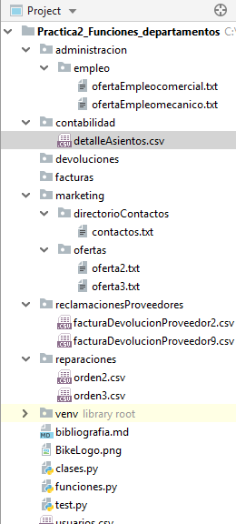

# Manual de usuario

Este manual de usuario está redactado para entender el funcionamiento del proyecto Practica2 Funciones
departamentos.

## Objetivo de la práctica

El objetivo del proyecto es simular el funcionamiento interno de un sistema de gestión empresarial
(ERP) creando un proyecto con el entorno de desarrollo `Pycharm` y utilizando el lenguaje de programación 
`Python 3.7`
Como requerimiento de la práctica se debe trabajar la siguiente materia:
- Programar 4 departamentos.
- Creación de 4 opciones por departamento.
- Persistencia de datos usando csv y txt.
- Trabajar Strings, Ficheros, Excepciones, Funciones, Listas y Diccionarios.
- Funcianiemto correcto del programa.


## Estructura

Teniendo en cuenta los requerimientos de la práctica se ha realizado la siguiente estructura:

- [Menús y submenús](#Menús-y-submenús)
- [Directorio de carpetas](#Directorio-de-carpetas)
- [Interactuación entre departamentos](#Interactuación-entre-departamentos) 
- [Directorio de carpetas](#Directorio-de-carpetas)

### Menús y submenús
    
    ---------------------------------------------------
           Bienvenido al menú principal            
    ---------------------------------------------------
    Selecciona opción:
    a) Servicio post-venta
    b) Ventas - Tienda
    c) Administración
    d) Taller
    e) Marketing
    f) Salir del sistema
    Opción: 

    
    ========== MENÚ ADMINISTRACIÓN ==========
    Selecciona opción:
    a) Contabilizar facturas
    b) Crear oferta de trabajo
    c) Gestión de usuarios
    d) Mostrar facturas activas
    e) Salir del menú
    Opción: 
    
    
    ====== SUBMENÚ GESTIÓN DE USUARIOS ======
    Selecciona opción:
    a) Nuevo usuario
    b) Borrar usuario
    c) Mostrar usuarios
    d) Salir del submenú
    Opción: 
    
### Directorio de carpetas
    


### Interactuación entre departamentos

***Explicación código ->***
Con la siguiente función se puede ver la simulación de una ERP internamente, es decir,
la intercomunicación entre los departamentos. A la vez que se genera una factura se 
está dando de alta un nuevo contacto en el sistema. El contacto se guardaría en el archivo `contactos.txt`
y la venta se guardaría en `facturas`  y a su vez generado el archivo `facturaNº.csv`.
No obstante a través del [video tutorial](https://www.youtube.com/watch?v=_nvZ9k6YpTE&feature=youtu.be) que se adjunta en el proyecto se podrá ver al detalle
el funcionamiento del proceso. 

````python
#Creo variables de control
def generarFacturaVenta():
diccionario = []
control = "s"
totalFactura = 0

while True:

    if control == "s":

        producto = input("Producto: ")

        if producto == "":
            print("Error, revise los datos")
        else:
            valor = input("Importe: ")

            importe = comprobar_numero_usuario(valor)

            totalFactura += importe

            linea = [producto, importe]
            diccionario.append(linea)

            control = input("Nuevo producto (s/n) ?")

    elif control == "n":

        print("Generando factura de venta ------>")

        #Pido datos de cliente de la factura
        cliente = input("Nombre cliente: ")
        telefono = input("Teléfono: ")
        mail = input("E-mail: ")
        fecha = time.strftime("%d/%m/%y")

        #Me aseguro que contengan datos la variables
        if cliente == "" or telefono == "" or mail == "":

            print("Error, datos vacíos.")

        else:
            #Genenro una lista que sera una linea del archivo csv
            cabecera = [fecha, cliente, telefono, mail, str(totalFactura)]

            # Creo un nuevo contacto para el departamento de marketing
            contacto = [cliente, telefono, mail]
            generarContacto(contacto)

            # Obtengo el ultimo numero de la factura
            ultNum = int(ultimoNumeroFactura())

            #Creo que el fichero que generara la factura
            mi_fichero = open("facturas/" + "factura" + str(ultNum + 1) + ".csv", "w+", newline="")

            diccionario.append(cabecera)

            #Escribo datos en el archivo
            with mi_fichero:
                writer = csv.writer(mi_fichero)
                writer.writerows(diccionario)

            print("Creada correctamente factura nº {}".format(str(ultNum + 1)))
            break


    else:
        control = input("Error, introduzca un dato correcto: (s/n)")


````


***Explicación ->***
En la siguiente función se detalla cómo se recorre el listado de directorios del proyecto para localizar
la carpeta donde se encuentran los archivos necesarios.
````python
# Funcion que muestra una lista de reparaciones
def listado_reparaciones():
    rootDir = '.'
    for dirName, subdirList, fileList in os.walk(rootDir):
        if "reparaciones" in dirName:
            print("Lista de {}: ".format("repaciones"))
            for fname in fileList:
                print('\t%s' % fname)


````
## Ejecutar el proyecto
Para poner en funcionamiento el proyecto descargar este repositorio a local, abrir en `PyCharm` de la carpeta
del repositorio `Entrega práctica2 Jose Armas\departamentos-RP` la carpeta de proyecto ***Practica2_Funciones_departamentos***.
Una vez abierto el proyecto abrir ***test.py*** ya dar a la opción `Run test.py`.


## Credenciales de usuario
Con la función `sistema_erp()` se inicializa todo el programa. Ésta es la que gestiona todo el 
funcionamiento interno del mismo a través de llamadas a otras funciones  que tienen funcionalidades
específicas, e interactuando con diferentes directorios y archivos.

Al iniciarse el programa se visualizará el menú principal que muestra los departamentos disponible.
Para acceder a ellos se puede entrar con cualquier usuario contenido en el archivo `archivos.csv`.
No obstante entrar con el ***usuario `usuario`*** y ***contraseña `usuario`*** para acceder a cualquier departamento,
excepto al de administración al que habrá que usar como ***usuario: `admin`*** y como ***contraseña `admin`***


## Materia trabajada

A continuación se muestra en detalle la teoría trabajada:

***Archivos***
````python
# Funcion que lee archivo csv y devuelve una lista da datos
def leer_csv(archivoLeer):
    datos = []
    with open(archivoLeer, newline='') as f:
        reader = csv.reader(f)
        for row in reader:
            datos.append(row)
    return datos
    
# Funcion que escribe un archivo csv
def escribir_csv(datos):
    lista = datos
    with open('usuarios.csv', 'w+', newline='') as f:
        writer = csv.writer(f)
        writer.writerows(lista)
        
# Funcion que genera un listado de contactos
def listado_contactos():
    contactos = []

    try:
        dirFichero = "marketing/directorioContactos/contactos.txt"
        with open(dirFichero, 'r',newline="") as reader:
            for line in reader:
                contactos.append(line)
        if len(contactos) == 0:
            print("No hay contactos registrados")
        else:
            for linea in contactos:
                print(linea, end="")


    except IOError:
        print("No existe un archivo de contactos")

    print("")

````

***Try Except***
````python
# Funcion para comprobar que el dato introducido por el usuario sea un numero
def comprobar_numero_usuario(numero):
    while True:
        num = None
        for conv in (int, float, complex):
            try:
                num = conv(numero)
                break
            except ValueError:
                pass
        if num is None:
            numero = input("Dato erróneo, inserte un numero:")
        else:
            return num
            break
````

***Manejo de Strings***
````python
#str.format()
("Creada la oferta de empleo {} correctamente".format(puesto))
````

***Clases***
````python
#Clase para dar color al texto
class color:
   PURPLE = '\033[95m'
   CYAN = '\033[96m'
   DARKCYAN = '\033[36m'
   BLUE = '\033[94m'
   GREEN = '\033[92m'
   YELLOW = '\033[93m'
   RED = '\033[91m'
   BOLD = '\033[1m'
   UNDERLINE = '\033[4m'
   END = '\033[0m'

#Utilización de la class color
mi_string = color.RED + " Menú ventas ".capitalize().upper() + color.END
````

## Bibliografia

- [Manejo de archivos y directorios en python](https://ricardogeek.com/manejo-de-archivos-y-directorios-en-python/)

- [Python Software Foundation - Pure Python MySQL Driver](https://pypi.org/project/PyMySQL/)

- [Crear documentos PDF en Python con ReportLab](https://recursospython.com/guias-y-manuales/crear-documentos-pdf-en-python-con-reportlab/)

- [Negrita python](https://stackoverflow.com/questions/8924173/how-do-i-print-bold-text-in-python)

- [Python 3.7.2 documentation](https://docs.python.org/3/)

## Conclusión
Este manual es creado como orientación para la correcta utilización del programa. Como se ha
podido leer, se encarga de trabajar con ficheros, crearlos, guardar datos, borrarlos, modificarlos y
el manejo de Strings, excepciones, listas, diccionarios y funciones.
Para más detalle se recomienda ver el siguiente vídeo tutorial.

## Video tutorial del funcionamiento del programa


[Ver video tutorial](https://youtu.be/ZZ28fj-F_k0)